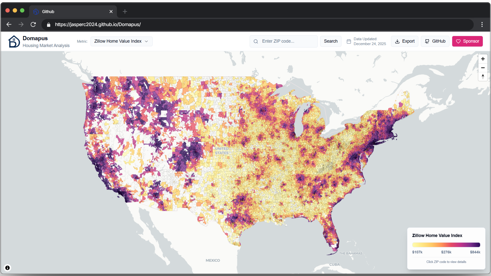

<p align="center">
    
</p>

<p align="center">
  <a href="https://jasperc2024.github.io/Domapus/">
    
  </a>
</p>

<p align="center">
  
  
  
</p>

**Domapus** is a website that visualizes U.S. housing market data at the ZIP-code level.  

---

## Features

### Main Dashboard
<p align="center">
Visualize median price, inventory, and sales trends nationwide. Hover over a ZIP code to show value.

</p>
<br>

### Granular ZIP Details
<p align="center">
Click on a ZIP code to access detailed market data.

</p>
<br>

### Comparative Analysis
<p align="center">
Compare two ZIP codes side-by-side to evaluate relative market performance across all available metrics.

</p>
<br>

### Export
<p align="center">
Generate report-ready maps with customizations.

</p>

---

## Quick Start

1. **Clone the repository**

   ```bash
   git clone https://github.com/Jasperc2024/Domapus.git
   cd Domapus
   ```

2. **Install dependencies**

   ```bash
   npm install
   ```

3. **Start the development server**

   ```bash
   npm run dev
   ```

4. **Open your browser**
   Navigate to `http://localhost:3677/Domapus/`

### Build for Production

```bash
npm run build && npm run preview
```

---

## Tech Stack
**Frontend:** React 18, TypeScript, Vite

**UI:** Tailwind CSS, Radix UI, Lucide React, Shadcn

**Map:** MapLibre GL JS, Pmtiles, Bbox, RBush

**Export:** html2canvas, jsPDF

**Deployment:** Github Pages

---

## Project Structure

See [tree.txt](tree.txt)

---

## Metrics Overview

| Metric | Choropleth Support |
| :--- | :---: |
| **Zillow Housing Value Index** | Yes |
| **Median Sale Price** | Yes |
| **Median Price per Sq Ft** | Yes |
| **Median Days on Market** | Yes |
| **Sale-to-List Ratio** | Yes |
| **Median List Price** | No |
| **Homes Sold** | No |
| **Pending Sales** | No |
| **New Listings** | No |
| **Inventory** | No |
| **% Sold Above List** | No |
| **% Off Market in 2 Weeks** | No |

---

## Data Sources

-  [Redfin Data Center](https://www.redfin.com/news/data-center/)
-  [Zillow Research](https://www.zillow.com/research/data/)

---

## Limitations

1.  **Data Coverage:** Redfin tracks only ZIP codes with active market. Rural ZIP codes with low transaction volume may report "N/A".
2.  **Update Frequency:** Data is aggregated on a monthly basis. This is not a real-time MLS feed.

---

## Contributing

### Development Workflow

1. Fork the repository
2. Create a feature branch: `git checkout -b feature/amazing-feature`
3. Make your changes with proper TypeScript types
4. Test your changes: `npm run build && npm run preview`
5. Run linting: `npm run lint`
6. Commit your changes: `git commit -m 'Add amazing feature'`
7. Push to your branch: `git push origin feature/amazing-feature`
8. Open a Pull Request

---

## License

This project is licensed under the MIT License - see the [LICENSE](LICENSE.md) file for details.

---

## Issues

- **Issues**: Report bugs and request features via [GitHub Issues](https://github.com/Jasperc2024/Domapus/issues)
- **Email**: You can contact the maintainer at [jasperc.wk@gmail.com](mailto:jasperc.wk@gmail.com)

---

## Support the Project

If you find Domapus useful, consider supporting its development:

[](https://buymeacoffee.com/JasperC)

---

<div align="center">
  <strong>Built by <a href="https://github.com/Jasperc2024">Jasper Chen</a></strong>
   <br><small>Distributed under the MIT License</small>
</div>
